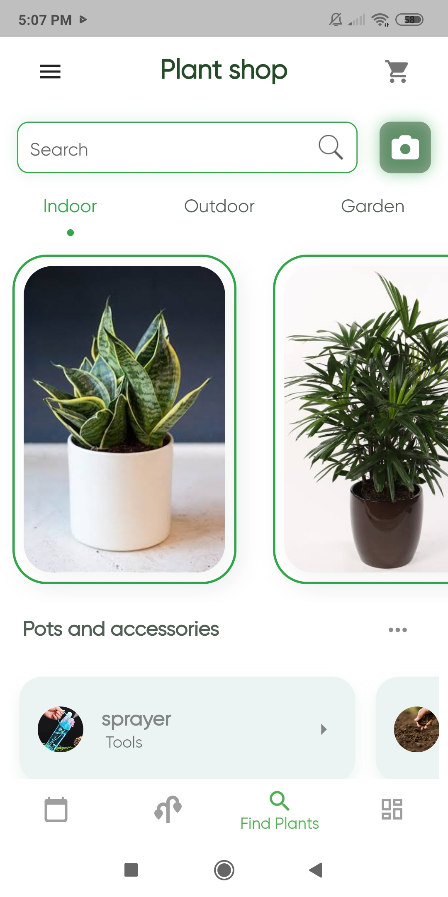
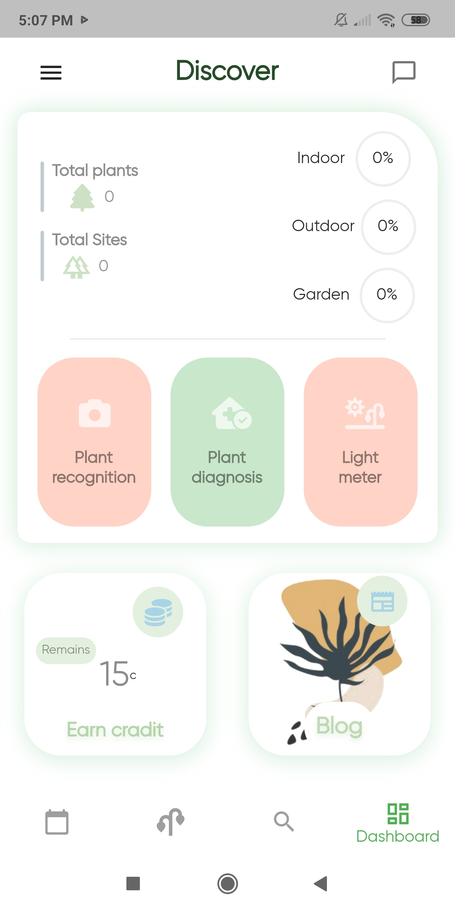
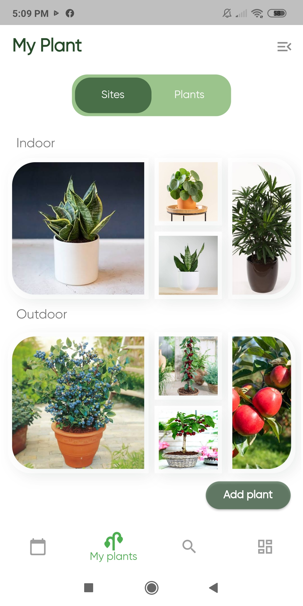
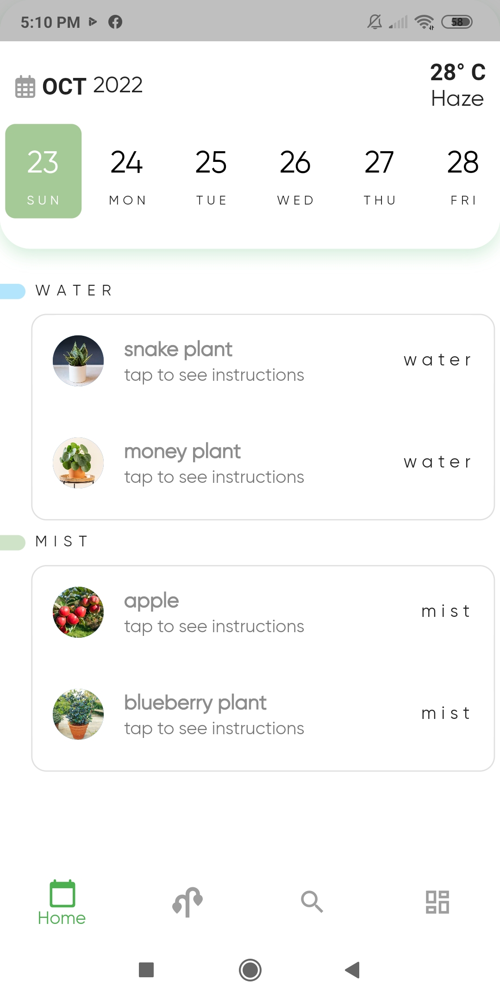

# Flutter Plant App

## Screenshots

| Plant shop | Discover |
| :---: | :---: |
|  |  |

| My plants | Care schedule |
| :---: | :---: |
|  |  |

## Local configuration

Provide your own Firebase configuration in android/app/google-services.json (excluded from Git). Set GOOGLE_MAPS_API_KEY and WEATHER_API_KEY using Flutter --dart-define options. Replace the Google Maps placeholder in AndroidManifest.xml and the Facebook client token placeholder in android/app/src/main/res/values/string.xml before running those integrations. PlantNet credentials are configured inside the app.
